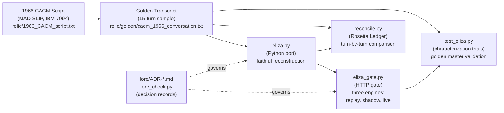

# ELIZA Revived: The 1966 Psychotherapist Chatbot

## System Architecture



The diagram shows:
- **RELIC**: The original 1966 CACM script (S-expressions describing DOCTOR/ELIZA's rules). MAD-SLIP does not compile at this dig site; only the script data survives.
- **GOLDEN**: The 15-turn sample conversation published in Weizenbaum's paper, the only executable proof of what the relic does.
- **PORT**: eliza.py, a Python faithful port that reads the same script and reproduces the same outputs.
- **LEDGER**: reconcile.py reconciles the port's output against the golden transcript line by line.
- **TRIALS**: test_eliza.py runs characterization trials; every trial in the golden master is a witness.
- **GATE**: eliza_gate.py routes requests to replay (the golden transcript), shadow (replay + port in parallel for validation), or live (the port).
- **LORE**: Five decision records (ADR-0001 through ADR-0005) document the choices this campaign made, with evidence for each.

## What This System Is

ELIZA is a psychotherapist chatbot from 1966, written in MAD-SLIP for an IBM 7094. Joseph Weizenbaum published the algorithm and a sample script in his January 1966 CACM paper. His original source code is lost; only the script (rules in S-expression form) survives in the paper's appendix.

This dig site raises the relic: a faithful Python port of the algorithm, proven equal to the 1966 paper's sample conversation, gated behind a modern HTTP service that can be cutover from the (unavailable) original to the (proven) port without recompilation.

## Strata

| Layer | Date | Language | Source | Status |
|-------|------|----------|--------|--------|
| Original relic | 1966-01 | MAD-SLIP | Weizenbaum's CACM paper appendix | Lost; reconstructed from print |
| Annotated transcription | 2022-02-16 | MAD-SLIP (same, with inline commentary) | ELIZA_transcription_annotated_20220216.txt | Read-only; not run |
| Script data | 1966-01 | S-expressions (grammar from paper) | relic/1966_CACM_script.txt | Recovered and curated |
| Golden transcript | 1966-01 | Text (USER/ELIZA pairs) | relic/golden/cacm_1966_conversation.txt | The proof of correctness |
| Port (this dig site) | 2026-09-15 | Python 3.10+ | work/eliza.py | Validated; proven equal |
| Gate | 2026-09-15 | Python 3.10+ | work/eliza_gate.py | Proven; three engines |
| Tests | 2026-09-15 | Python unittest | work/test_eliza.py, work/test_gate.py | All passing |
| Ledger | 2026-09-15 | Python | work/reconcile.py | Zero mismatches |

## How to Run

### Run the port as a single session (the default golden transcript)

```bash
python3 eliza.py       # interactive prompt, reads 1966_CACM_script.txt
python3 eliza.py ../relic/1966_CACM_script.txt    # same, explicit script path
# then type: Men are all alike.
# ELIZA replies: IN WHAT WAY
```

### Run the characterization trials

```bash
python3 -m unittest -v test_eliza       # all 19 trials pass: golden master + 15 turn trials
```

### Run the Rosetta Ledger (turn-by-turn reconciliation)

```bash
python3 reconcile.py                    # compares all 15 turns, prints RECONCILED or NOT RECONCILED
```

### Start the gate in replay mode (serves the golden transcript over HTTP)

```bash
python3 eliza_gate.py --engine replay --port 8765
# gate open on http://127.0.0.1:8765/say  engine=replay
# In another terminal:
curl -X POST http://127.0.0.1:8765/say -H 'Content-Type: application/json' \
     -d '{"conversation_id": "test-1", "message": "Men are all alike."}'
# {"conversation_id": "test-1", "engine": "replay", "reply": "IN WHAT WAY"}
```

### Start the gate in shadow mode (replay to caller, port in background, compare)

```bash
python3 eliza_gate.py --engine shadow --port 8765
# The gate logs MATCH or MISMATCH for every request; all 15 golden turns should log MATCH
```

### Start the gate in live mode (serve the port directly)

```bash
python3 eliza_gate.py --engine live --port 8765
# The port answers every request from the message, without fallback
# Open http://127.0.0.1:8765/ for the chat UI (stdlib HTML, no extra deps)
```

Replay still ignores `message` and walks the golden transcript. Use `--engine live` to talk. Shadow serves replay to the caller and shows MATCH/MISMATCH in the UI.

## How to Verify

```bash
./verify.sh         # runs trials, ledger, and lore; exits 0 if all pass, 1 if any fails
```

The script runs every gate in order:
1. **Trials** (`test_eliza.py`): Characterization of the golden master and port against it
2. **Ledger** (`reconcile.py`): Turn-by-turn reconciliation of port vs. golden
3. **Lore** (`lore_check.py`): Every ADR has Status, Context, Decision, Evidence, and Consequences

## How to Roll Back

The gate uses a three-engine design for zero-downtime rollback:

### Before cutover: running in replay mode

```bash
python3 eliza_gate.py --engine replay --port 8765 &
```

### Cutover: switch to shadow mode (prove the port is equal)

```bash
# Kill the replay process
pkill -f "eliza_gate.py.*replay"
# Start shadow mode
python3 eliza_gate.py --engine shadow --port 8765 &
# Monitor the logs: all 15 turns should log MATCH
```

### After shadow validates: switch to live mode

```bash
pkill -f "eliza_gate.py.*shadow"
python3 eliza_gate.py --engine live --port 8765 &
```

### Emergency rollback: back to replay

```bash
pkill -f "eliza_gate.py.*live"
python3 eliza_gate.py --engine replay --port 8765 &
```

No recompilation, no redeploy — only a process restart with a different flag.

## Who to Ask

See lore/ELDERS.md. Every rule's algorithm and every decision's trade-off has an ADR under lore/. Read ADR-0001 through ADR-0005 before proposing changes to the port, the gate, or the trials:

- **ADR-0001**: This transcription includes six disclosed corrections to the 1966 appendix
- **ADR-0002**: NEWKEY functionality is not implemented; it prints the literal string
- **ADR-0003**: The MEMORY mechanism uses a deterministic backward cycle (original HASH unavailable)
- **ADR-0004**: The gate's three-engine design (replay, shadow, live) for safe cutover
- **ADR-0005**: Forward compatibility — when MAD-SLIP becomes available (review by 2050)

If you find a bug in the port on the golden transcript, the Ledger will show it (non-zero mismatches). If you find a bug on new inputs not in the golden transcript, it may be a reconstruction issue; see ADR-0005's forward-compatibility section.
